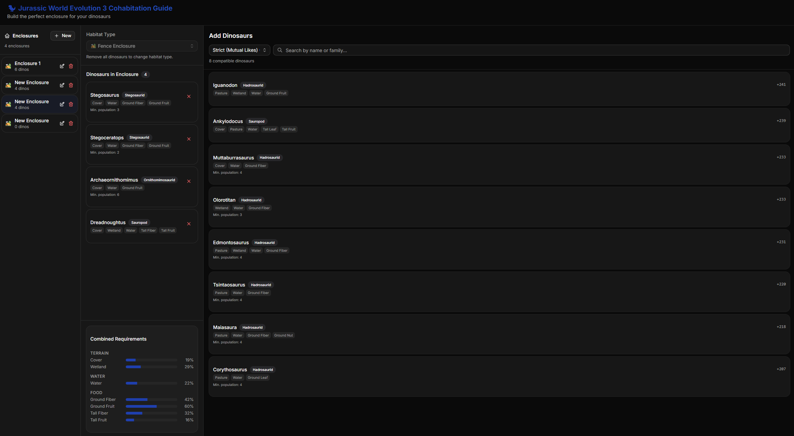

# Jurassic World Evolution 3 - Cohabitation Guide

A static tool to find ideal cohabitation for JWE3 dinosaurs.



## What you can do

- Create an enclosure, which will track the needs of the dinosaurs in it
- Get warnings if there are potential clashes
- See the environmental needs of the total enclosure, such as landscape types and food sources you will need to build
- Get a a sorted list of the best dinosaurs to add to the enclosure, based on overlap with the existing needs

## 🤖 Tech Stack

**Core Stack:**
- **Framework:** React 19 + TypeScript + Vite
- **Styling:** Tailwind CSS 4 + shadcn/ui
- **Testing**: Vitest + React Testing Library
- **Package Manager:** Bun

**Development Rules:**
- **Design:** Use "Inter" font.
- **Icons:** Use `@tabler/icons-react`.
- **State:** Keep it simple (React context or local state) unless complex.
- **Components:** favor shadcn/ui components in `src/components/ui`.
- **Deployment:** GitHub Pages (static build).

## 🚀 Commands

```bash
# Install dependencies
bun install

# Start local dev server
bun dev

# Build for production
bun run build

# Lint
bun run lint

# test
bun run test

# Sanity: lint + typecheck + test - prefer this
bun run sanity
```


## Instructions

- All code should be modular and reusable, composable, and testable
- Lean towards using shadcn/ui components before creating new components where possible
- Always run `bun run sanity` before finishing any task, it runs lint, typecheck, and tests all in one easily
- Tests don't need to have 100% coverage, but every function and component (that isn't auto-generated) should have at least one test case showing it can run
